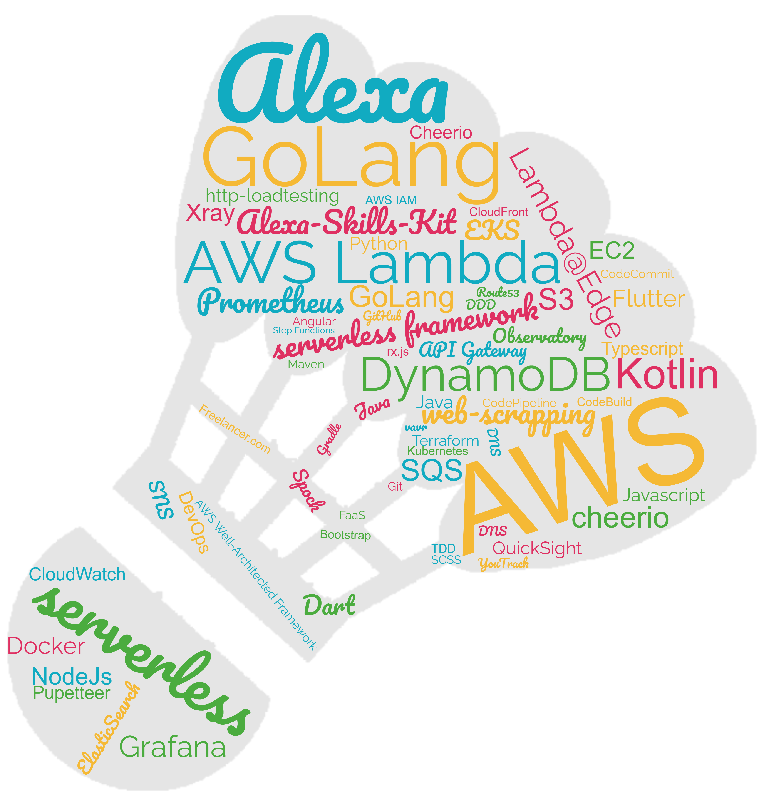

* 🏸 Creator of www.badminton-elo.de (TechStack is form 01/2020 - keep on learning 💪)
* 🧐 Interested in architecture and leading teams from a tech perspective
* 💼 Software Architecture and Speaker (checkout SSPES) at DATEV e.G.
* 💻 10+ years experience as Software Architect
* 🎓 Master of Science with Honours in Computer Science, 1.2 (lower is better in Germany 😉)

  <i>Take a look at my repositories and let's get in touch!</i>

